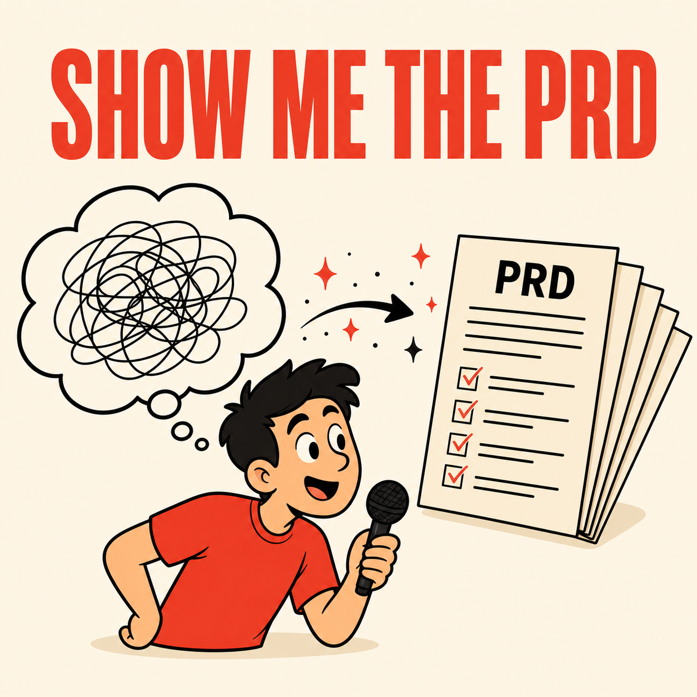

[English](README.md) | [한국어](README.ko.md) | 中文 | [日本語](README.ja.md) | [Español](README.es.md)

# show-me-the-prd

<p align="center">
  
</p>

> **为 vibe coder 打造的访谈式 PRD 生成器 — 从一句话到 4 份设计文档。**

把一个想法变成完整的产品方案。回答 5–6 个结构化问题，即可得到 4 份可直接交给任何 AI 编程工具的设计文档。

[快速开始](#快速开始) • [为什么选 show-me-the-prd](#为什么选-show-me-the-prd) • [工作原理](#工作原理) • [主要功能](#主要功能) • [命令](#命令) • [环境要求](#环境要求)

---

## 快速开始

### 1. 添加市场

```
/plugin marketplace add https://github.com/fivetaku/gptaku_plugins.git
```

### 2. 安装插件

```
/plugin install show-me-the-prd
```

### 3. 重启 Claude Code

插件在会话启动时加载 — 安装后重启一次即可。

### 4. 开始规划

```
/show-me-the-prd I want to build a photo organization app
```

也可以直接用自然语言：

```
Make me a PRD for a task manager
```

---

## 为什么选 show-me-the-prd

- **无需产品规划经验** — 每个问题都配有平实的说明和利弊分析，不堆术语
- **AI 主导，你来决定** — AI 实时调研各种选项并以选择题呈现；你完全不用自己去搜索
- **基于调研，而非拍脑袋** — 功能清单、技术栈对比、复杂度评级全部由实时网络检索支撑
- **一次生成 4 份文档，而不是 1 份** — PRD、数据模型、阶段计划、AI 项目规范作为一套连贯的整体同时产出
- **面向真实上线** — 每个阶段都以真实部署、真实认证、真实数据库为目标，而不是本地 mock
- **已有方案也欢迎** — 把现有的规格文档丢进来，插件会找出缺口并补齐

---

## 工作原理

```
One-sentence idea
       |
       v
  [ Interview ]  ←── live web research runs between each question
       |
   Turn 1: clarify the idea (1–3 questions)
   Turn 2: pick core features + MVP scope
   Turn 3: confirm data model
   Turn 4: confirm phase breakdown
   Turn 5: choose tech stack + auth method
       |
       v
  [ 4 Documents ]
       |
       +── PRD/01_PRD.md            What you're building and who it's for
       +── PRD/02_DATA_MODEL.md     Core data structure (conceptual ERD)
       +── PRD/03_PHASES.md         Phase plan with start prompts
       +── PRD/04_PROJECT_SPEC.md   AI rules + "never do this" list
       +── PRD/README.md            Navigation guide
```

访谈中的每个选项都包含平实的说明、优点、缺点和复杂度评级（Simple / Moderate / Complex）。拿不准时，选标有 **(recommended)** 的那个就行。

---

## 主要功能

### 访谈式规划

不需要懂开发术语。它不会说"请选择认证策略"，而是问"用户怎么登录？"，并给出"社交登录（Google/Kakao）"、"邮箱 + 密码"这样的具体选项。

### 实时网络调研

在每轮访谈之间，插件会实时检索相关功能、常见坑点和当前的最佳实践技术栈。你在选项里看到的内容都来自真实检索结果，而不是写死的建议。

### 复杂度指引

功能选择环节中，每个功能都会标注：

| 标签 | 含义 |
|-------|---------|
| Simple | 大多数框架开箱即用 |
| Moderate | 需要接入外部服务，可能产生费用 |
| Complex | 建议第一版先跳过 |

### 4 份产出文档

| 文档 | 内容 | 使用时机 |
|----------|----------|-------------|
| `01_PRD.md` | 产品目标、用户故事、功能清单 | 项目启动时分享 |
| `02_DATA_MODEL.md` | 核心实体及其关系 | 设计数据库时分享 |
| `03_PHASES.md` | 带启动提示词的阶段计划 | 作为开发顺序参考 |
| `04_PROJECT_SPEC.md` | AI 行为规则 + "绝对别做"清单 | 每次会话都分享给 AI |

### 方案补强模式

如果你已经有规格文档或笔记，请在运行命令前先分享出来。插件会通读它们，对照 4 文档标准找出缺失部分，只针对缺口提出必要的问题。

---

## 命令

| 命令 | 说明 |
|---------|-------------|
| `/show-me-the-prd [idea]` | 带上想法直接开始访谈 |
| `/show-me-the-prd` | 从交互式开场问题开始 |

### 自然语言触发

说下面这些话也会自动启动：

- "给我做个 PRD"
- "写一份规划文档"
- "Show me the PRD"
- "帮我规划这个应用"
- "帮我规划 [想法]"

---

## 环境要求

- [Claude Code](https://docs.anthropic.com/claude-code) CLI

### 可选插件（推荐）

与 show-me-the-prd 一起安装可提升调研质量：

| 插件 | 带来什么 |
|--------|-------------|
| `docs-guide` | 技术栈调研时查阅官方文档 |
| `insane-research` | 更深入的市场与趋势分析 |

没有它们也能正常工作 — 会自动回退到 WebSearch。

---

## 许可证

MIT

---

<div align="center">

**输入一句话，输出四份文档。**

</div>
